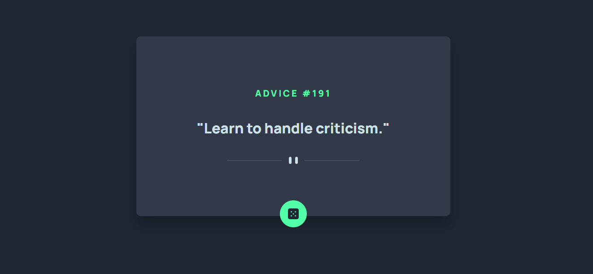

# Frontend Mentor - Advice generator app solution

This is a solution to the [Advice generator app challenge on Frontend Mentor](https://www.frontendmentor.io/challenges/advice-generator-app-QdUG-13db). Frontend Mentor challenges help you improve your coding skills by building realistic projects.

## Overview

### The challenge

Users should be able to:

- View the optimal layout for the app depending on their device's screen size
- See hover states for all interactive elements on the page
- Generate a new piece of advice by clicking the dice icon

### Screenshot

### Links

- Solution URL: [https://www.frontendmentor.io/solutions/javascript-promises-api-mobile-first-design-O2cqrNeFkr](https://www.frontendmentor.io/solutions/javascript-promises-api-mobile-first-design-O2cqrNeFkr)
- Live Site URL: [https://mv805.github.io/advice-generator-app-main/](https://mv805.github.io/advice-generator-app-main/)

## My process

### Built with

- Flexbox
- CSS Grid
- Advice API
- Javascript
- Mobile First Design

### What I learned

I had some fun working with this API and creating a responsive widget with funny quotes that update at the user command. I was able to build the whole page and all elements in Javascript without any hard coding HTML of the body element. 

I was able to manipulate the page with a media query to ensure smooth mobile first responsive design.

## Author

- Github - [Matt Villa](https://github.com/mv805)
- Frontend Mentor - [@mv805](https://www.frontendmentor.io/profile/mv805)
